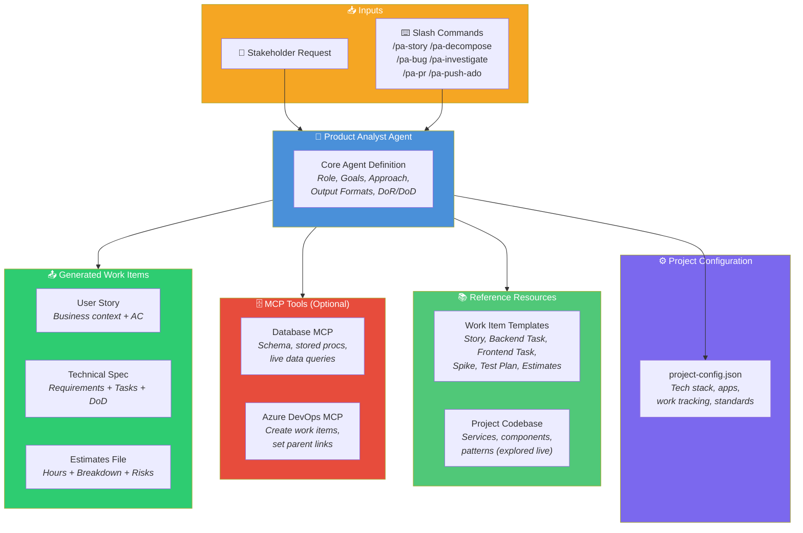
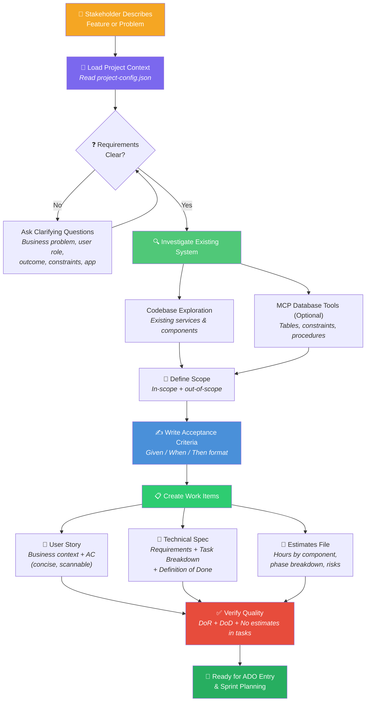
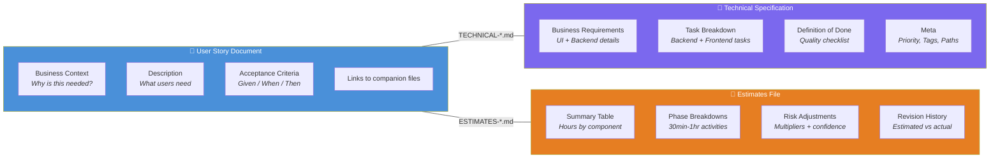
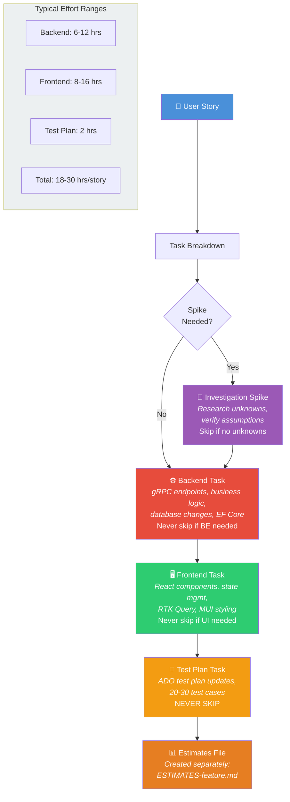
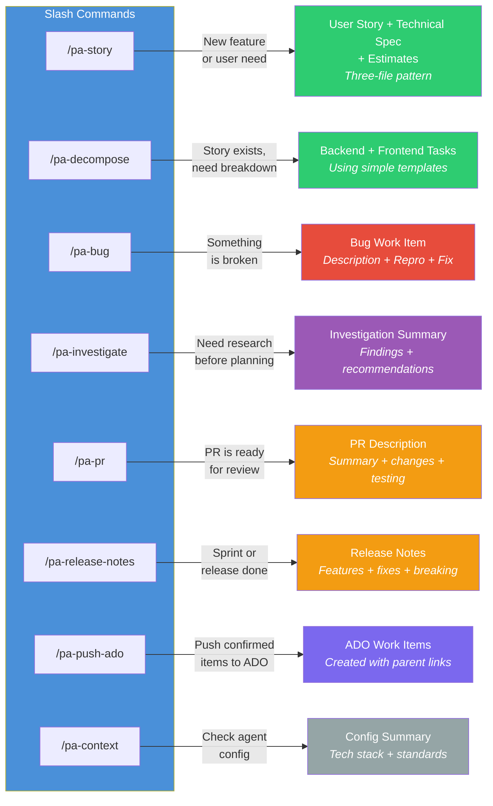
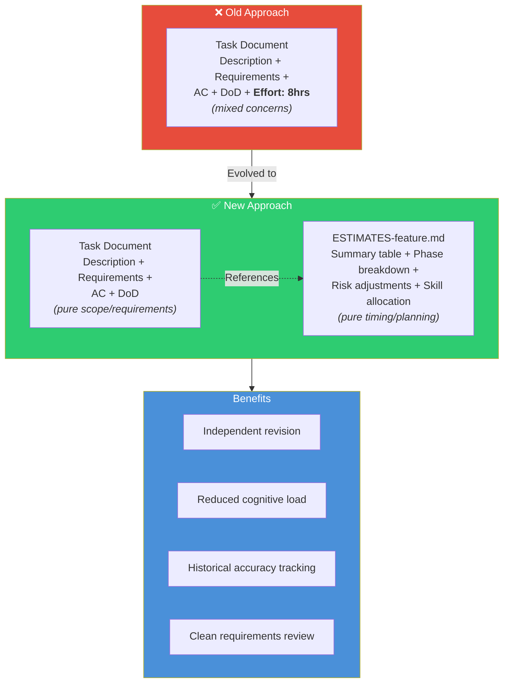

# Product Analyst Agent - Visual Diagrams

> Visual reference for how the Product Analyst AI agent works, its workflow, structure, and outputs.

---

## 1. Architecture

Overview of all components the PA agent uses to generate work items.



**Key points:**

- The agent always reads `project-config.json` first to understand tech stack
- The agent explores the project codebase directly to identify existing services and components
- MCP database tools allow live schema/data investigation (optional, configured per project)
- Azure DevOps MCP enables pushing work items directly to ADO (optional)
- Three output files are generated per feature (story, technical spec, estimates)

---

## 2. Work Item Creation Workflow

Step-by-step process from stakeholder request to sprint-ready work items.



**Key workflow rules:**

1. Always load project context **before** asking questions
2. Clarify requirements iteratively until scope is clear
3. Investigate existing implementation before writing requirements
4. Define explicit in-scope and out-of-scope boundaries
5. Validate against DoR/DoD checklists before finalizing

---

## 3. Three-Document Pattern

How each feature produces three separate files with distinct responsibilities.



**Why three files?**

- **User Story** stays concise and scannable (business stakeholders read this)
- **Technical Spec** has implementation details (developers read this)
- **Estimates** can be revised independently without changing requirements

---

## 4. Story Decomposition - Task Breakdown

Standard order and types of tasks generated from every user story.



**Rules:**

- Spike is optional (skip if no unknowns exist)
- Backend and Frontend tasks are mandatory when applicable
- Test Plan task is **NEVER** skipped
- Estimates always go in a separate file, never in task documents

---

## 5. Agent Commands and Outputs

Available slash commands and what each produces.



| Command             | When to Use                          | Output                                          |
| ------------------- | ------------------------------------ | ----------------------------------------------- |
| `/pa-story`         | Stakeholder describes a new feature  | User Story + Technical Spec + Estimates         |
| `/pa-decompose`     | Story exists, need task breakdown    | Backend + Frontend tasks using simple templates |
| `/pa-bug`           | Something is broken                  | Bug with Description, Repro Steps, Fix          |
| `/pa-investigate`   | Need research before planning        | Investigation summary with findings             |
| `/pa-pr`            | PR is ready for review               | PR description with summary and testing notes   |
| `/pa-release-notes` | Sprint or release is complete        | Release notes with features, fixes, breaking    |
| `/pa-push-ado`      | Work items confirmed, push to ADO    | Work items created in ADO with parent links     |
| `/pa-context`       | Verify agent is configured correctly | Summary of loaded project config and tech stack |

---

## 6. Repository Structure

File organization for all PA workflow resources.

```text
repository-root/
├── .github/
│   ├── agents/
│   │   └── product-analyst-core.agent.md
│   └── prompts/
│       ├── pa-context.prompt.md
│       ├── pa-story.prompt.md
│       ├── pa-decompose.prompt.md
│       ├── pa-bug.prompt.md
│       ├── pa-investigate.prompt.md
│       ├── pa-pr.prompt.md
│       ├── pa-release-notes.prompt.md
│       └── pa-push-ado.prompt.md
└── documentation/
    ├── project-config.json
    ├── CUSTOMIZATION-GUIDE.md
    ├── MCP-SETUP.md
    ├── PA-AGENT-DIAGRAMS.md
    ├── guides/
    │   ├── QUICK-START-PRODUCT-ANALYST.md
    │   ├── TASK-DECOMPOSITION-GUIDE.md
    │   ├── ESTIMATES-SEPARATION-GUIDE.md
    │   └── ESTIMATES-TEMPLATE.md
    └── work-item-templates/
        ├── business-focused-user-story-template.md
        ├── business-focused-task-template.md
        ├── backend-task-simple.md
        ├── frontend-task-simple.md
        ├── spike-task-template.md
        └── test-plan-task-template.md
```

**Data flow:**

1. Agent loads project context from `documentation/project-config.json`
2. Slash commands route to prompt files in `.github/prompts/`
3. Prompts use `documentation/work-item-templates/` to keep outputs consistent

---

## 7. Estimates Separation Pattern

The critical pattern of keeping estimates out of task documents.



**The rule is simple:** Task documents describe _what_ and _why_. Estimates describe _how long_ and _with what confidence_. They change for different reasons, so they live in different files.
