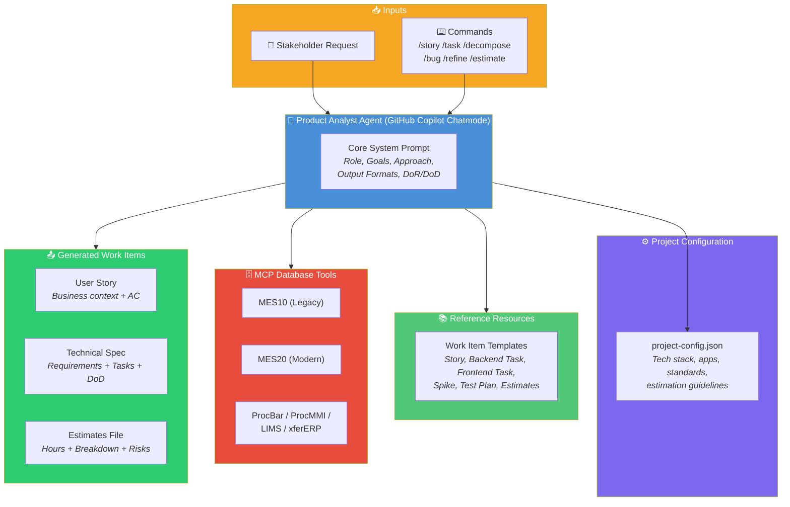
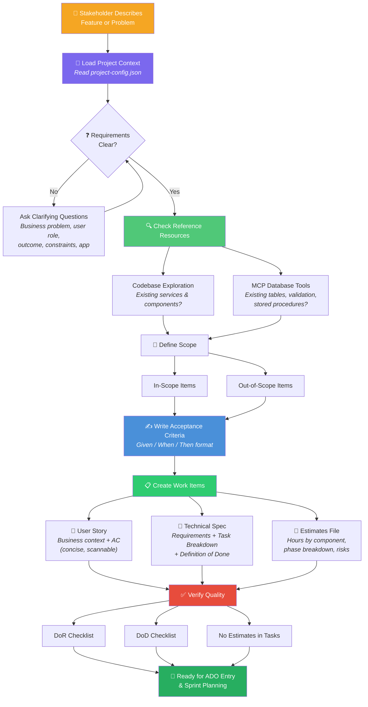
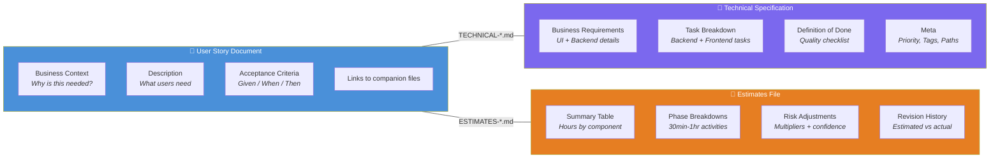
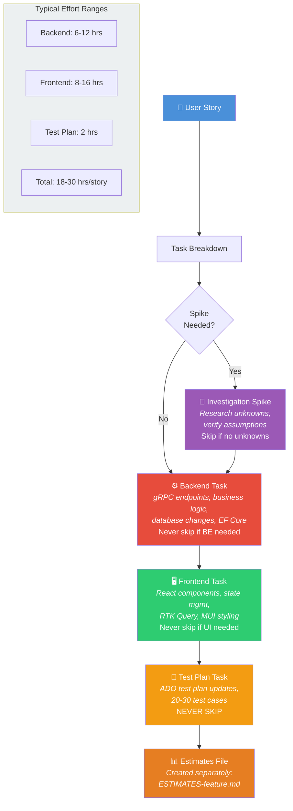
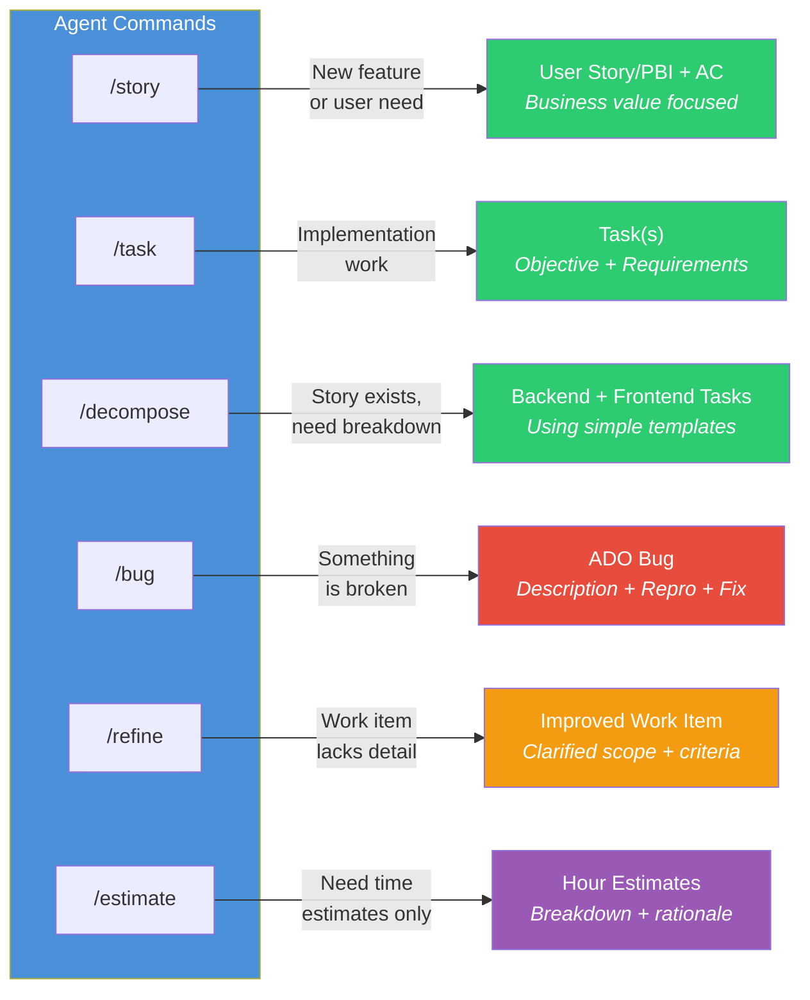
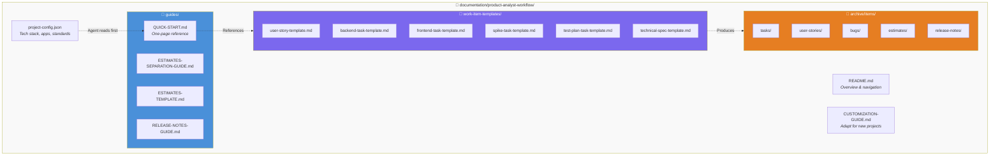
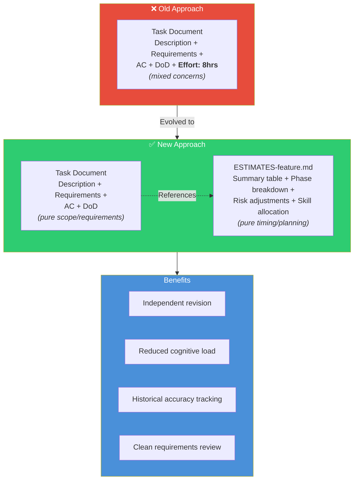

# Product Analyst Agent - Visual Diagrams

> Visual reference for how the Product Analyst AI agent works, its workflow, structure, and outputs.

---

## 1. "Architecture"

Overview of all components the PA agent uses to generate work items.

**Key points:**

- The agent always reads `project-config.json` first to understand tech stack
- MCP database tools allow live schema/data investigation
- The agent explores the project codebase directly to identify existing services and components
- Three output files are generated per feature (story, technical spec, estimates)

---

## 2. Work Item Creation Workflow

Step-by-step process from stakeholder request to sprint-ready work items.

**Key workflow rules:**

1. Always load project context **before** asking questions
2. Clarify requirements iteratively until scope is clear
3. Check all three resource types (services, components, database)
4. Define explicit in-scope and out-of-scope boundaries
5. Validate against DoR/DoD checklists before finalizing

---

## 3. Two-Document Pattern

How each feature produces three separate files with distinct responsibilities.

**Why three files?**

- **User Story** stays concise and scannable (business stakeholders read this)
- **Technical Spec** has implementation details (developers read this)
- **Estimates** can be revised independently without changing requirements

---

## 4. Story Decomposition - Task Breakdown

Standard order and types of tasks generated from every user story.

**Rules:**

- Spike is optional (skip if no unknowns exist)
- Backend and Frontend tasks are mandatory when applicable
- Test Plan task is **NEVER** skipped
- Estimates always go in a separate file, never in task documents

---

## 5. Agent Commands and Outputs

Available slash commands and what each produces.

Current prompt sources: `.github/agents/product-analyst.agent.md` and `.github/agents/product-analyst-core.agent.md`.

| Command      | When to Use                         | Output                                            |
| ------------ | ----------------------------------- | ------------------------------------------------- |
| `/story`     | Stakeholder describes a new feature | User Story/PBI with business context + AC         |
| `/task`      | Breaking down implementation work   | Task(s) with Objective + Requirements             |
| `/decompose` | Story exists, need full breakdown   | Backend + Frontend tasks using simple templates   |
| `/bug`       | Something is broken                 | Single ADO bug with Description, Repro Steps, Fix |
| `/refine`    | Work item lacks detail or clarity   | Improved work item with clarified scope/criteria  |
| `/estimate`  | Need timing without full work items | Hour-based estimates with rationale and breakdown |

---

## 6. Repository Structure

File organization for all PA workflow resources.

**Data flow:**

1. Agent reads `project-config.json` first (tech stack context)
2. Quick Start guide references templates
3. Templates are used to produce work items in `archive/items/`

---

## 7. Estimates Separation Pattern

The critical pattern of keeping estimates out of task documents.

**The rule is simple:** Task documents describe _what_ and _why_. Estimates describe _how long_ and _with what confidence_. They change for different reasons, so they live in different files.
